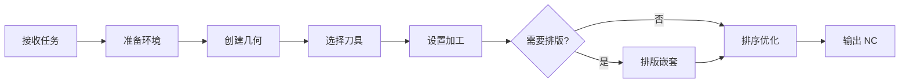

# AI 软件工作流程

## 1. 总则

- **适用范围**：AlphaCAM 2016 R1 + MCP 桥接器
- **核心原则**：先查后改、先备份再操作、每步设撤销点
- **文档来源**：基于 CDM VBA 源码（`CDM.arb` 中 Globals/Database/Functions/Events 模块）分析提炼

---

## 2. 通用 CAM 工作流程



### 2.1 接收任务
解析用户需求，确认关键参数：

| 参数 | 说明 | 示例 |
|------|------|------|
| 材料 | 板材类型/厚度 | SPC 石塑板 / 18mm 中纤板 |
| 加工方式 | 粗精加工/铣槽/雕刻/钻孔 | RoughFinish + Engrave |
| 刀具 | 刀具名称/直径 | 6mm 铣刀 / 3mm 雕刻刀 |
| 尺寸 | 工件长宽 | 600×400mm |
| 数量 | 批量数量 | 50 件 |

### 2.2 准备环境
```python
# 打开或新建图纸
open_drawing("path/to/file.amd")
# 或
new_drawing()

# 设置撤销点
set_undo_point(text="准备环境")
```

### 2.3 创建几何 → 选择刀具 → 设置加工 → 排序 → 输出 NC
（通用流程使用 MCP 几何/加工工具链，详见 README）

---

## 3. CDM 橱柜门专项工作流程

CDM 是一个独立的 VBA 插件，其操作**不走 MCP 几何/加工工具**，而是通过 VBA 宏 + 直接操作 CDM 数据库实现。

### 3.1 CDM 架构概述

```
CDM.arb (VBA 插件)
    │
    ├── Events.InitAlphacamAddIn  → 注册 CDM 菜单
    ├── Events.m_Processing       → 打开主界面（UI 模式）
    ├── Events.m_OrderToolPaths   → 刀具路径排序
    │
    ├── Database (模块)           → ADODB 数据库操作层
    │   ├── gbln_ConnectToDB      → 连接 Access 数据库 (CDM.udl)
    │   ├── grst_GetOrders        → 查询订单
    │   ├── grst_GetOrderDetails  → 查询订单明细
    │   └── g_CloseDBConnection   → 关闭连接
    │
    ├── Globals (模块)            → 全局变量/常量/枚举
    │   ├── DEF_MACRO_VERSION     = "3.0"
    │   ├── DOOR_TYPE_DATA 类型   → 订单+门板数据结构
    │   └── AdoorUpdateDatabaseFlag → 数据库版本管理
    │
    └── Functions (模块)          → 工具函数
        ├── gs_FixSQL             → SQL 字符串转义
        ├── gdbl_Scrap            → 废料率计算
        └── gbln_InsertDrawing    → 插入外部图纸
```

### 3.2 CDM 数据库结构

CDM 使用 **Access 数据库**（通过 `CDM.udl` 连接），核心表：

| 表名 | 用途 | 关键字段 |
|------|------|---------|
| `AD_ORDERS` | 订单主表 | OrderID, JobName, CustomerID, DueDate |
| `AD_ORDER_DETAILS` | 门板明细 | DetailID, OrderID, TypeName, Width, Length, Quantity, Material |
| `AD_DOOR_TYPES` | 门类型定义 | TypeID, StyleNumber, 加工参数 |
| `AD_DOOR_PATHS` | 刀路定义 | PathID, TypeID, PathNumber, ToolName, 加工参数 |
| `AD_MATERIALS` | 材料库 | Name, Thickness, SheetWidth, SheetLength |
| `AD_CUSTOMERS` | 客户 | CustomerID, Name |
| `AD_REPORT_DATA` | 报表数据 | OrderID, SheetNumber, 排版结果 |
| `AD_SETTINGS` | 系统设置 | NCSeqNum, 各类默认值 |

### 3.3 CDM 流程实现（三路径方案）

> ⚠️ **CDM 没有暴露"创建订单/导入 CSV"的独立 VBA 函数**，这些功能只能在 CDM 的 UI 界面中手动操作。以下提供三种自动化方案。

#### 路径 A：直接操作数据库（推荐）

通过 `run_vba_line` 直接向 CDM 数据库写入订单和门板数据。

```python
# 步骤 1：连接 CDM 数据库
run_vba_line('gbln_ConnectToDB')

# 步骤 2：创建订单（INSERT 到 AD_ORDERS）
run_vba_line('''
    Dim lngRet As Long
    gdb_CDM.Execute "INSERT INTO AD_ORDERS (JobName, CustomerID, OrderDate) " & _
                    "VALUES (''7-10中林SPC婷兰灰'', 1, Date())", lngRet
''')

# 步骤 3：获取新订单 ID
run_vba_line('''
    Dim rst As ADODB.Recordset
    Set rst = gdb_CDM.Execute("SELECT @@IDENTITY AS NewID")
    Dim lngOrderID As Long
    lngOrderID = rst.Fields("NewID")
    rst.Close
''')

# 步骤 4：从 CSV 逐行读取门板数据并 INSERT 到 AD_ORDER_DETAILS
# （需要编写一个完整的 VBA 模块来实现 CSV 解析 + 批量插入）
```

**优点**：完全自动化，无需人工干预
**缺点**：CSV 解析逻辑较复杂，需编写自定义 VBA 模块

#### 路径 B：调用 CDM UI 界面

```python
# 调用 CDM 主界面（用户需手动操作创建订单和导入）
run_vba_macro(macro_name="CDM.m_Processing")
```

**优点**：简单直接
**缺点**：需要人工交互，无法全自动

#### 路径 C：自定义批量导入 VBA 模块 ⭐（推荐）

源码文件已实现：**[`CDM功能/BatchImport.bas`](CDM功能/BatchImport.bas)**

安装使用：

```python
# 步骤 1：安装模块（从源码文件读取）
with open("CDM功能/BatchImport.bas", "r", encoding="utf-8") as f:
    code = f.read()

install_vba_module(
    module_name="BatchImport",
    code=code,
)

# 步骤 2：执行导入（指定 CSV 文件和订单名）
run_vba_macro(
    macro_name="CDM.BatchImport.Run",
    params=["C:\\Users\\C\\Desktop\\2026优化表\\7-10中林SPC婷兰灰.csv",
            "7-10中林SPC婷兰灰"],
)

# 步骤 3：在 CDM 主界面中完成门型配置和加工处理
# （导入的订单会出现在 CDM 的 Processing 界面中）
run_vba_macro(macro_name="CDM.m_Processing")
```

---

## 4. 具体任务实现：创建订单 → 导入 CSV → 批量生产

### 4.1 任务解析

```
任务目标：
  1. 打开 CDM
  2. 创建新订单 "7-10中林SPC婷兰灰"
  3. 从 C:\Users\C\Desktop\2026优化表 目录导入同名 .csv 文件
  4. 执行批量生产
```

### 4.2 CSV 文件格式

实际 CSV 文件（`7-10中林SPC婷兰灰.csv`，GBK 编码，14 列，9 行数据）：

```csv
造型名称,宽度,高度,数量,颜色,客户名称,订单号,开启方向,终端地址,板件码,产品名称,备注,,
SPC2,375.1,999,1,中林SPC肤感婷兰灰杉木芯,主卧掩门下柜,260702-012,右开,郁南阿坤-金信大厦塔B604,260702-012-5-1,主卧掩门下柜,上下120。上斜切,,
SPC2,375.1,999,1,中林SPC肤感婷兰灰杉木芯,主卧掩门下柜,260702-012,左开,郁南阿坤-金信大厦塔B604,260702-012-6-1,主卧掩门下柜,上下120。上斜切,,
T形门板,397,1705,1,SK-SPC肤感婷兰灰杉木芯,鞋柜,260702-013,右开,郁南-学士路2-1903,260702-013-4-1,鞋柜,镂空100+602+1104+1556,,
...
```

| 列 | 名称 | 映射到 CDM 字段 | 说明 |
|----|------|----------------|------|
| 0 | 造型名称 | `TypeName` | 门板造型（SPC2、T形门板等） |
| 1 | 宽度 | `Width` | 门板宽度(mm) |
| 2 | 高度 | `Length` | 门板高度(mm) |
| 3 | 数量 | `Quantity` | 数量 |
| 4 | 颜色 | `Material` | 材料/颜色名 |
| 5 | 客户名称 | — | 产品所属柜体名（存为备注） |
| 9 | 板件码 | — | 唯一板件标识 |
| 10 | 产品名称 | — | 中文描述 |
| 11 | 备注 | `ProductionComment` | 加工备注 |

### 4.3 实现步骤

```python
# ── 第 1 步：安装自定义批量导入模块 ──
install_vba_module(
    module_name="BatchImport",
    code="""Option Explicit

Public Sub ImportCSVAndCreateOrder()
    ' 订单名称
    Dim sJobName As String
    sJobName = "7-10中林SPC婷兰灰"
    
    ' CSV 文件路径
    Dim sCSVPath As String
    sCSVPath = "C:\\Users\\C\\Desktop\\2026优化表\\7-10中林SPC婷兰灰.csv"
    
    ' 连接数据库
    If Not gbln_ConnectToDB Then
        MsgBox "数据库连接失败"
        Exit Sub
    End If
    
    ' 创建订单
    Dim lngRet As Long
    gdb_CDM.Execute "INSERT INTO AD_ORDERS (JobName, CustomerID, OrderDate) " & _
                    "VALUES ('" & gs_FixSQL(sJobName) & "', 1, Date())", lngRet
    
    ' 获取新订单 ID
    Dim rst As ADODB.Recordset
    Set rst = gdb_CDM.Execute("SELECT @@IDENTITY AS NewID")
    Dim lngOrderID As Long
    lngOrderID = rst.Fields("NewID").Value
    rst.Close
    
    ' 解析 CSV 并插入明细
    ' ...（CSV 逐行读取逻辑）
    
    MsgBox "订单创建完成！订单号: " & lngOrderID
End Sub
"""
)

# ── 第 2 步：执行导入 ──
run_vba_macro(macro_name="CDM.BatchImport.ImportCSVAndCreateOrder")

# ── 第 3 步：执行批量生产 ──
# 调用 CDM 的加工处理（注：此部分需要在 CDM UI 中配置门型和刀路）
# 或通过 VBA 直接调用 CDM 的 Nest + Process 函数
```

---

## 5. 错误处理与恢复

### 5.1 CDM 数据库操作异常

```python
# 检查数据库连接
run_vba_line('If gdb_CDM Is Nothing Then MsgBox "未连接数据库"')

# 回滚未提交的事务
run_vba_line('gdb_CDM.RollbackTrans')
```

### 5.2 通用异常

| 异常类型 | 处理方式 |
|---------|---------|
| COM 连接断开 | MCP 自动重连（指数退避，最多 5 次） |
| VBA 执行错误 | 检查错误输出，修正代码后重试 |
| 文件不存在 | 先用 `os.path.exists` 验证路径 |

---

## 6. 操作规范速查

| 规则 | 说明 |
|------|------|
| ✅ 每步设撤销点 | `set_undo_point(text="步骤名")` |
| ✅ 先查后改 | `get_drawing_info` 确认当前状态 |
| ✅ 批量操作锁定屏幕 | `lock_acam()` + `unlock_acam(zoom_all=True)` |
| ❌ 禁止改变主窗口大小/位置 | `Width/Height/Left/Top/WindowState` 不可设置 |
| ✅ COM 操作后释放 | 系统自动 `gc.collect()` |
