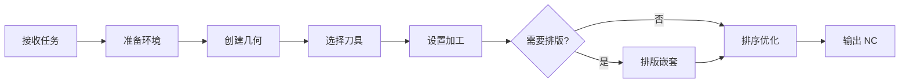

# AI 软件工作流程

## 1. 总则

- **适用范围**：AlphaCAM 2016 R1 + MCP 桥接器
- **核心原则**：先查后改、先备份再操作、每步设撤销点
- **文档来源**：基于 CDM VBA 源码（`CDM.arb` 中 Globals/Database/Functions/Events 模块）分析提炼

---

## 2. 通用 CAM 工作流程



### 2.1 接收任务
解析用户需求，确认关键参数：

| 参数 | 说明 | 示例 |
|------|------|------|
| 材料 | 板材类型/厚度 | SPC 石塑板 / 18mm 中纤板 |
| 加工方式 | 粗精加工/铣槽/雕刻/钻孔 | RoughFinish + Engrave |
| 刀具 | 刀具名称/直径 | 6mm 铣刀 / 3mm 雕刻刀 |
| 尺寸 | 工件长宽 | 600×400mm |
| 数量 | 批量数量 | 50 件 |

### 2.2 准备环境
```python
# 打开或新建图纸
open_drawing("path/to/file.amd")
# 或
new_drawing()

# 设置撤销点
set_undo_point(text="准备环境")
```

### 2.3 通用流程
通用 CAM 操作使用 MCP 几何/加工工具链（详见 README）。

---

## 3. CDM 橱柜门模块

CDM 是一个独立的 VBA 插件，通过数据库 + VBA 宏驱动，**不走 MCP 几何/加工工具**。

> **说明**：CDM 原始 Processing 流程绑定在 `frmNTCW` 窗体 UI 中，`Make` 模块所有加工函数（`mbln_Style_xxx`、`mbln_MakeMachining` 等）均为 `Private`。但订单创建（写入数据库）和批量生产（通过 AlphaCAM API）已通过自定义模块实现自动化。

### 3.1 自动化模块一览

| 模块 | 文件 | 功能 | 自动化 |
|------|------|------|--------|
| **BatchImport** | [`CDM功能/BatchImport.bas`](CDM功能/BatchImport.bas) | 从 CSV 导入门板数据 → 创建 CDM 订单 | ✅ 完全自动 |
| **BatchProcess** | [`CDM功能/BatchProcess.bas`](CDM功能/BatchProcess.bas) | 从数据库读取门板 → AlphaCAM API 生成几何+刀路 | ✅ 完全自动 |
| `Events.m_OrderToolPaths` | CDM.arb 内置 | 排序刀具路径 | ✅ 可调用 |

### 3.2 CDM 数据库结构

CDM 使用 **Access 数据库**（`D:\2016\LICOMDAT\CDM Data\CDM.mdb`，通过 `CDM.udl` 连接），核心表：

```
CDM.arb (VBA 插件)
    │
    ├── Events.InitAlphacamAddIn  → 注册 CDM 菜单
    ├── Events.m_Processing       → 打开主界面（UI 模式）
    ├── Events.m_OrderToolPaths   → 刀具路径排序
    │
    ├── Database (模块)           → ADODB 数据库操作层
    │   ├── gbln_ConnectToDB      → 连接 Access 数据库 (CDM.udl)
    │   ├── grst_GetOrders        → 查询订单
    │   ├── grst_GetOrderDetails  → 查询订单明细
    │   └── g_CloseDBConnection   → 关闭连接
    │
    ├── Globals (模块)            → 全局变量/常量/枚举
    │   ├── DEF_MACRO_VERSION     = "3.0"
    │   ├── DOOR_TYPE_DATA 类型   → 订单+门板数据结构
    │   └── AdoorUpdateDatabaseFlag → 数据库版本管理
    │
    └── Functions (模块)          → 工具函数
        ├── gs_FixSQL             → SQL 字符串转义
        ├── gdbl_Scrap            → 废料率计算
        └── gbln_InsertDrawing    → 插入外部图纸
```

| 表名 | 用途 | 关键字段 |
|------|------|---------|
| `AD_ORDERS` | 订单主表 | OrderID, JobName, CustomerID, DueDate |
| `AD_ORDER_DETAILS` | 门板明细 | DetailID, OrderID, TypeName, Width, Length, Quantity, Material |
| `AD_DOOR_TYPES` | 门类型定义 | TypeID, StyleNumber, 加工参数 |
| `AD_DOOR_PATHS` | 刀路定义 | PathID, TypeID, PathNumber, ToolName, 加工参数 |
| `AD_MATERIALS` | 材料库 | Name, Thickness, SheetWidth, SheetLength |
| `AD_CUSTOMERS` | 客户 | CustomerID, Name |
| `AD_REPORT_DATA` | 报表数据 | OrderID, SheetNumber, 排版结果 |
| `AD_SETTINGS` | 系统设置 | NCSeqNum, 各类默认值 |

### 3.3 完整工作流（三段式自动化）

```python
# ══════════════════════════════════════════════════════════
# CDM 橱柜门完整工作流
# ══════════════════════════════════════════════════════════

# ── 第 1 步：安装模块（只需首次）──
code = open("CDM功能/BatchImport.bas").read()
install_vba_module(module_name="BatchImport", code=code)

code = open("CDM功能/BatchProcess.bas").read()
install_vba_module(module_name="BatchProcess", code=code)


# ── 第 2 步：导入 CSV → 创建订单（完全自动 ✅）──
run_vba_macro(
    macro_name="CDM.BatchImport.Run",
    params=["C:\\Users\\C\\Desktop\\2026优化表\\7-10中林SPC婷兰灰.csv",
            "7-10中林SPC婷兰灰"],
)


# ── 第 3 步：批量生产（完全自动 ✅）──
# 按订单名称自动处理所有门板
run_vba_macro(
    macro_name="CDM.BatchProcess.RunByName",
    params=["7-10中林SPC婷兰灰"],
)

# 或按 OrderID：
# run_vba_macro(macro_name="CDM.BatchProcess.Run", params=["1"])


# ── 第 4 步：排序 + NC 输出（完全自动 ✅）──
run_vba_macro(macro_name="CDM.m_OrderToolPaths")
select_post(post_name="T3香蕉弯")
output_nc(file_path="D:\\output\\7-10中林SPC婷兰灰.nc")
```

---

## 5. 错误处理与恢复

### 5.1 CDM 数据库操作异常

```python
# 检查数据库连接
run_vba_line('If gdb_CDM Is Nothing Then MsgBox "未连接数据库"')

# 回滚未提交的事务
run_vba_line('gdb_CDM.RollbackTrans')
```

### 5.2 通用异常

| 异常类型 | 处理方式 |
|---------|---------|
| COM 连接断开 | MCP 自动重连（指数退避，最多 5 次） |
| VBA 执行错误 | 检查错误输出，修正代码后重试 |
| 文件不存在 | 先用 `os.path.exists` 验证路径 |

---

## 6. 操作规范速查

| 规则 | 说明 |
|------|------|
| ✅ 每步设撤销点 | `set_undo_point(text="步骤名")` |
| ✅ 先查后改 | `get_drawing_info` 确认当前状态 |
| ✅ 批量操作锁定屏幕 | `lock_acam()` + `unlock_acam(zoom_all=True)` |
| ❌ 禁止改变主窗口大小/位置 | `Width/Height/Left/Top/WindowState` 不可设置 |
| ✅ COM 操作后释放 | 系统自动 `gc.collect()` |
